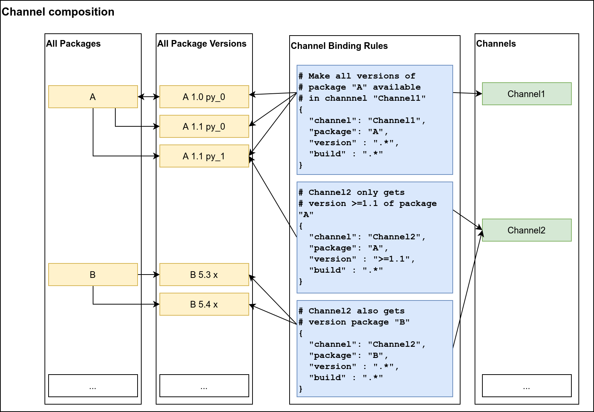
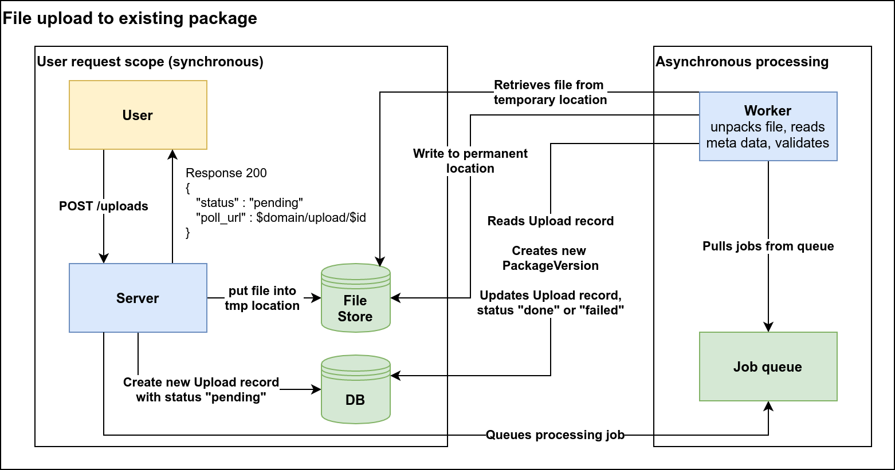

# Gonda: a conda server written in Go

# Concept

`gonda` uses the following components:
1. A stateless http web server, which serves user requests for down- and uploads.
2. A SQL database storing `Package`, `PackageVersion` and `Channel` data, as well as user information, and data about the state of the system.
3. A file storage backend, typically cloud blob storage, to hold the package files.
4. A job queue and one or more workers that process queued jobs.

## Channel composition

`gonda` treats packages and channels as independent. `Package`s and `PackageVersion`s exist on their own, and may or may not be associated to any `Channel`. What is available in a given channel is defined through `ChannelBinding`s, which conntect `PackageVersion`s to `Channel`. This scheme has the advantage that we can easily change the content of a `Channel` by adjusting the bindings, without actually moving files around. It also means that one package can be available through multiple channels, but we still only need to keep one physical copy of the file.

## Upload

New package versions are created by users through the upload of a conda package file (`.conda` or `.bz2`). Package versions can only be created in this way for packages that have already been registered in the server.

File uploads require postprocessing for parsing and validation of the uploaded file. Therefore, the upload process is split into a short synchronous portion, and a subsequent asynchronous processing step. The folowing diagram illustrates the process.

1. The user sends a mime post request including the form file to be uploaded to the server.
2. The server performs synchronous actions:
   1. saves the file to `_upload/{temporary filename}` in the storage backend
   2. creates a new `Upload` record with status `pending` in the DB.
   3. Queues a job to process the `Upload` record.
   4. Returns an URL to the user that can be polled for the status of the `Upload`.
3. Asynchronous processing:
   1. the temporary file is extracted and its meta data is read
   2. It is asserted that the `Package` for this file exists
   3. It is asserted that the `PackageVersion` for this file does not exist yet

## Permission system

TBD